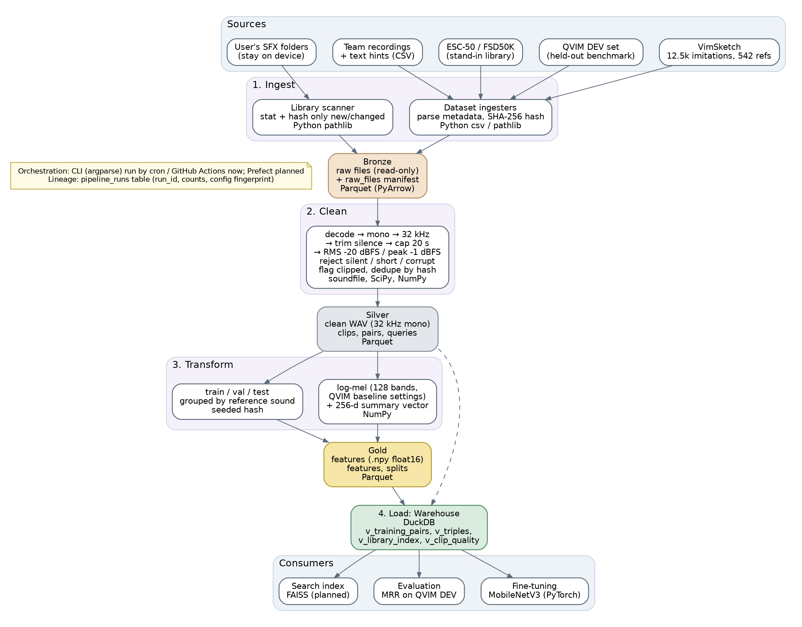

# VocaLocate data pipeline

Initial version of the A2 Part Three data-processing pipeline. It ingests the
datasets from A2 Part Two and a user's own SFX folders, cleans the audio,
computes features and train/val/test splits, and loads everything into a
DuckDB warehouse.



## Layers

| Layer | Contents | Format |
| --- | --- | --- |
| Bronze | Raw files exactly as downloaded, plus a `raw_files` manifest (hash, size, labels, licence) | original audio + Parquet |
| Silver | Clean audio (mono, 32 kHz, trimmed, loudness-normalised) and the `clips`, `pairs` and `queries` tables | 16-bit WAV + Parquet |
| Gold | Log-mel features with the QVIM baseline settings, a 256-value summary vector per clip, and `splits` | float16 `.npy` + Parquet |
| Warehouse | All tables plus views for training, triples, the library index and data quality | DuckDB |

Table schemas are in [`src/vocalocate_pipeline/schemas.py`](src/vocalocate_pipeline/schemas.py),
and the folder layout is in [`lake.py`](src/vocalocate_pipeline/lake.py).

## Two flows

* **Dataset flow** (`ingest-dataset`): VimSketch, the QVIM DEV set, ESC-50 and
  team recordings. Run when a dataset is first downloaded, when its version
  changes, or when the cleaning/feature settings change.
* **Library flow** (`index-library`): a user's SFX folders, processed
  incrementally. Unchanged files are skipped by size and modification time,
  moved files are recognised by their hash, and deleted files are marked as
  deleted. See [`docs/diagrams/library_flow.png`](docs/diagrams/library_flow.png).

Both flows cache work by content hash and config fingerprint, so a re-run only
processes new or changed files. Every run writes a row to `pipeline_runs`.

## Usage

```bash
cd pipeline
pip install -e '.[dev]'

# ESC-50: git clone https://github.com/karolpiczak/ESC-50
vocalocate-pipeline --lake lake --workers 4 -v ingest-dataset --source esc50 --path ESC-50
vocalocate-pipeline --lake lake ingest-dataset --source vimsketch --path Vim_Sketch_Dataset
vocalocate-pipeline --lake lake ingest-dataset --source qvim_dev --path qvim-dev
vocalocate-pipeline --lake lake index-library --root ~/SFX --name my_library

vocalocate-pipeline --lake lake report            # data-quality summary
vocalocate-pipeline --lake lake report --sql "SELECT split, count(*) FROM v_training_pairs GROUP BY split"
```

Settings live in [`configs/default.toml`](configs/default.toml); pass another
file with `--config` for a different environment.

## Tests

```bash
cd pipeline && python -m pytest -q
```

The tests build small synthetic datasets laid out exactly like ESC-50,
VimSketch, the QVIM DEV set and team recordings, so they run offline in a few
seconds.

## Not implemented yet

See the "Next steps" section of the A2 write-up. In short: Prefect
orchestration and schedules, S3/MinIO storage, speech filtering for library
files, Freesound and freesound-laion-640k ingestion, augmentation, hard-negative
mining, FAISS indexing, and a parity test against the torchaudio feature code.
